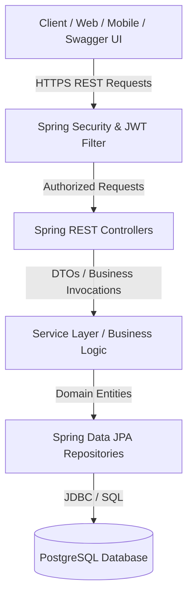
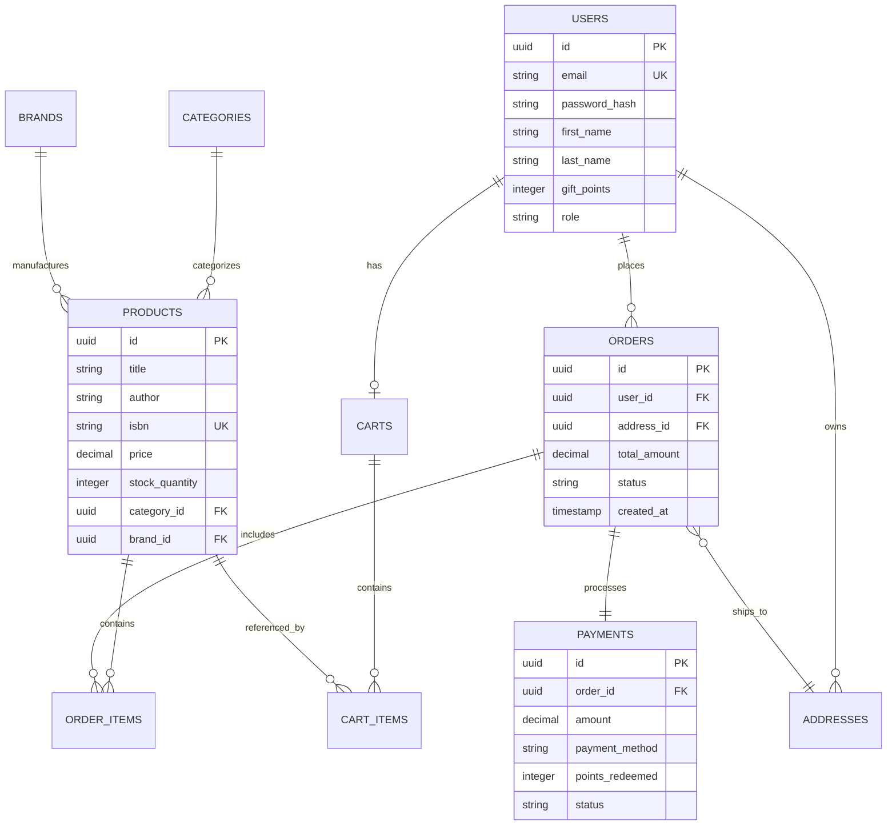

# AI Specialist Capstone Project: E-Commerce Bookstore Platform Overview

## 1. Executive Summary
The **E-Commerce Bookstore Platform** is an enterprise-grade RESTful backend application built using **Spring Boot 3**, **Java 21**, and **PostgreSQL**. The platform powers an end-to-end digital bookstore experience, enabling users to authenticate, explore product catalogs, manage shopping carts, complete multi-step checkout processes with address and payment handling, track order history, and receive tailored book recommendations.

This project was designed and implemented as part of the **AI Specialist Capstone Project** leveraging Agentic AI workflows with **IBM BOB** (Agentic IDE).

---

## 2. Project Goals & Objectives
- **Demonstrate AI-Assisted Engineering**: Utilize agentic AI workflows (IBM BOB) to analyze wireframes, generate OpenAPI specifications, scaffold enterprise architectures, implement domain logic, and produce unit/integration test suites.
- **End-to-End E-Commerce Workflows**: Cover complete customer journeys from catalog browsing, cart operations, delivery address management, payment processing with gift points redemption, to order tracking and 48-hour order cancellation.
- **Secure & Robust Architecture**: Enforce strict security controls including JWT stateless authentication, password hashing (BCrypt), input validation, exception handling, and parameterized database interactions.

---

## 3. System Architecture & Tech Stack

### 3.1 Technology Stack
| Layer | Technology / Tool | Version | Description |
| :--- | :--- | :--- | :--- |
| **Language** | Java | 21 (LTS) | Modern Java language features |
| **Framework** | Spring Boot | 3.5.4 | Enterprise backend framework |
| **Security** | Spring Security & JJWT | 0.12.6 | Stateless JWT Authentication & RBAC |
| **ORM / Data Access**| Spring Data JPA / Hibernate | 6.x | Entity mapping & repository persistence |
| **Primary Database**| PostgreSQL | 15+ | Production relational database |
| **Testing DB** | H2 Database | 2.x | In-memory database for unit & integration testing |
| **API Documentation**| SpringDoc OpenAPI 3 / Swagger UI | 2.8.5 | Interactive API documentation & testing |
| **Build Tool** | Apache Maven | 3.9+ | Dependency management & project build |
| **AI Workflows** | IBM BOB | Latest | Agentic AI IDE for code generation and analysis |

### 3.2 High-Level Architecture Flow


---

## 4. Key Functional Modules & Customer Journeys

The platform maps directly to the customer journey wireframes outlined in the project specification:

### 4.1 Authentication & Profile (`/api/v1/auth`)
- User registration and JWT-based authentication.
- Fetch current authenticated profile details (`/me`).
- Automatic allocation of starting loyalty/gift points for new accounts.

### 4.2 Product Catalog, Brands & Categories (`/api/v1/products`, `/categories`, `/brands`)
- Paginated, filterable, and searchable product catalog (filter by category, brand, price range).
- Product details with real-time stock and tentative delivery estimation (+3 days from order).
- **Related Products**: Fetches products in the same category.
- **Personalized Recommendations**: Context-aware recommendations computed from the user's historical purchases.

### 4.3 Shopping Cart (`/api/v1/cart`)
- Add books to basket, update quantities, remove items, or clear cart.
- Dynamic cart subtotal calculation and inventory stock checks.

### 4.4 Delivery Address Management (`/api/v1/addresses`)
- Add, view, manage, and delete multiple shipping/delivery addresses.
- Set default address for checkout.

### 4.5 Orders & Order Lifecycle (`/api/v1/orders`)
- **Place Order**: Snapshot items, delivery address, tax, shipping, and calculate total.
- **Order History**: Review previous orders and track fulfillment status (`PENDING`, `CONFIRMED`, `SHIPPED`, `DELIVERED`, `CANCELLED`).
- **Buy-Again Feature**: One-click re-adding of past ordered items back into the shopping cart.
- **Order Cancellation (48-Hour SLA)**: Allows cancellation of orders strictly within 48 hours of order creation.

### 4.6 Payment & Loyalty Points (`/api/v1/payments`)
- Multiple payment method support (`CREDIT_CARD`, `DEBIT_CARD`, `UPI`, `NET_BANKING`).
- **Gift Points Redemption**: Allows redeeming reward points against the total order amount.
- Real-time payment verification and receipt generation.

---

## 5. Entity Relationship & Data Model



---

## 6. Development & AI-Augmented Workflow

Following the Capstone instructions, the development lifecycle was executed as follows:

1. **Wireframe & Requirements Analysis**: Extracted core customer journeys, data entities, and business constraints (e.g., 48-hour cancellation policy, gift point redemptions).
2. **OpenAPI 3.0 Specification**: Generated [`openapi.yaml`](openapi.yaml) defining all REST contracts, DTO schemas, and security schemes.
3. **Backend Scaffolding with IBM BOB**: Generated Spring Boot entities, repositories, service layers, security filters, and controllers adhering to clean architecture principles.
4. **Database Configuration**: Set up PostgreSQL schema and seed data for immediate testing and demonstration.
5. **Quality Assurance & Verification**:
   - Automated unit and integration tests configured with H2 in-memory DB (`./mvnw test`).
   - Interactive testing using Swagger UI (`http://localhost:8080/swagger-ui.html`).
6. **Git Versioning & PR Workflow**:
   - Work managed under `feature/api-implementation`.
   - Ready for Pull Request review on GitHub.

---

## 7. How to Run and Verify

### Prerequisites
- Java 21 JDK
- PostgreSQL 15+
- Maven 3.9+ (or use `./mvnw`)

### Execution Steps
```bash
# 1. Clone repository
git clone https://github.com/rajzzh-learn/ebookstore-capstone.git
cd ebookstore-capstone/ebookstore

# 2. Configure environment variables
cp .env.example .env
# Edit .env with your PostgreSQL credentials & JWT secret

# 3. Build the application
./mvnw clean install

# 4. Run the Spring Boot application
./mvnw spring-boot:run

# 5. Access Swagger UI & Documentation
# Open http://localhost:8080/swagger-ui.html in your browser
```
