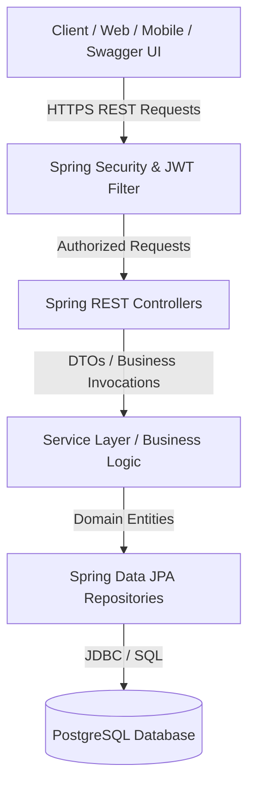
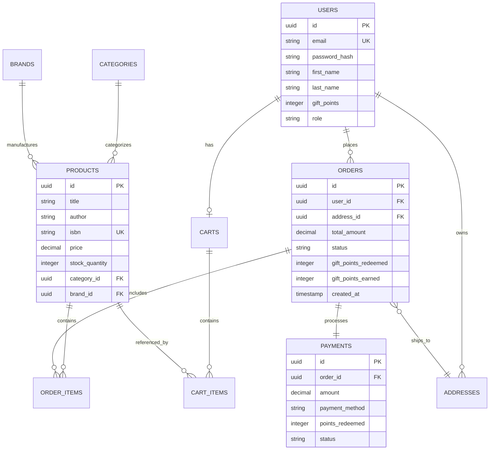

# AI Specialist Capstone Project: E-Commerce Bookstore Platform Overview

## 1. Executive Summary
The **E-Commerce Bookstore Platform** is an enterprise-grade RESTful backend application built using **Spring Boot 3**, **Java 21**, and **PostgreSQL**. The platform powers an end-to-end digital bookstore experience, enabling users to authenticate, explore product catalogs, manage shopping carts, complete multi-step checkout processes with address and payment handling, track order history, and receive tailored book recommendations.

This project was designed and implemented as part of the **AI Specialist Capstone Project** leveraging Agentic AI workflows with **IBM BOB** (Agentic IDE).

---

## 2. Project Goals & Objectives
- **Demonstrate AI-Assisted Engineering**: Utilize agentic AI workflows (IBM BOB) to analyze wireframes, generate OpenAPI specifications, scaffold enterprise architectures, implement domain logic, and produce unit/integration test suites.
- **End-to-End E-Commerce Workflows**: Cover complete customer journeys from catalog browsing, cart operations, delivery address management, payment processing with gift points redemption, to order tracking and 48-hour order cancellation.
- **Secure & Robust Architecture**: Enforce strict security controls including JWT stateless authentication, password hashing (BCrypt), input validation, exception handling, and parameterized database interactions.

---

## 3. System Architecture & Tech Stack

### 3.1 Technology Stack
| Layer | Technology / Tool | Version | Description |
| :--- | :--- | :--- | :--- |
| **Language** | Java | 21 (LTS) | Modern Java language features |
| **Framework** | Spring Boot | 3.5.4 | Enterprise backend framework |
| **Security** | Spring Security & JJWT | 0.12.6 | Stateless JWT Authentication & RBAC |
| **ORM / Data Access**| Spring Data JPA / Hibernate | 6.x | Entity mapping & repository persistence |
| **Primary Database**| PostgreSQL | 15+ | Production relational database |
| **Testing DB** | H2 Database | 2.x | In-memory database for unit & integration testing |
| **API Documentation**| SpringDoc OpenAPI 3 / Swagger UI | 2.8.5 | Interactive API documentation & testing |
| **Build Tool** | Apache Maven | 3.9+ | Dependency management & project build |
| **AI Workflows** | IBM BOB | Latest | Agentic AI IDE for code generation and analysis |

### 3.2 High-Level Architecture Flow


---

## 4. Key Functional Modules & Customer Journeys

The platform maps directly to the customer journey wireframes outlined in the project specification:

### 4.1 Authentication & Profile (`/api/v1/auth`)
- User registration and JWT-based authentication.
- Fetch current authenticated profile details (`/me`).
- Automatic allocation of starting loyalty/gift points for new accounts.

### 4.2 Product Catalog, Brands & Categories (`/api/v1/products`, `/categories`, `/brands`)
- Paginated, filterable, and searchable product catalog (filter by category, brand, price range).
- Product details with real-time stock and tentative delivery estimation (+3 days from order).
- **Related Products**: Fetches products in the same category.
- **Personalized Recommendations**: Context-aware recommendations computed from the user's historical purchases.

### 4.3 Shopping Cart (`/api/v1/cart`)
- Add books to basket, update quantities, remove items, or clear cart.
- Dynamic cart subtotal calculation and inventory stock checks.

### 4.4 Delivery Address Management (`/api/v1/addresses`)
- Add, view, manage, and delete multiple shipping/delivery addresses.
- Set default address for checkout.

### 4.5 Orders & Order Lifecycle (`/api/v1/orders`)
- **Place Order**: Snapshot items, delivery address, tax, shipping, and calculate total.
- **Order History**: Review previous orders and track fulfillment status (`PENDING`, `CONFIRMED`, `SHIPPED`, `DELIVERED`, `CANCELLED`).
- **Buy-Again Feature**: One-click re-adding of past ordered items back into the shopping cart.
- **Order Cancellation (48-Hour SLA)**: Allows cancellation of orders strictly within 48 hours of order creation.

### 4.6 Payment & Loyalty Points (`/api/v1/payments`)
- Multiple payment method support (`CREDIT_CARD`, `DEBIT_CARD`, `UPI`, `NET_BANKING`).
- **Gift Points Redemption**: Allows redeeming reward points against the total order amount.
- Real-time payment verification and receipt generation.

---

## 5. Entity Relationship & Data Model



---

## 6. Development & AI-Augmented Workflow

Following the Capstone instructions, the development lifecycle was executed as follows:

1. **Wireframe & Requirements Analysis**: Extracted core customer journeys, data entities, and business constraints (e.g., 48-hour cancellation policy, gift point redemptions).
2. **OpenAPI 3.0 Specification**: Generated [`openapi.yaml`](openapi.yaml) defining all REST contracts, DTO schemas, and security schemes.
3. **Backend Scaffolding with IBM BOB**: Generated Spring Boot entities, repositories, service layers, security filters, and controllers adhering to clean architecture principles.
4. **Database Configuration**: Set up PostgreSQL schema and seed data for immediate testing and demonstration.
5. **Quality Assurance & Verification**:
   - Automated unit and integration tests configured with H2 in-memory DB (`./mvnw test`).
   - Interactive testing using Swagger UI (`http://localhost:8080/swagger-ui.html`).
6. **Git Versioning & PR Workflow**:
   - Work managed under `feature/api-implementation`.
   - Ready for Pull Request review on GitHub.

---

## 7. How to Run and Verify

### Prerequisites
- Java 21 JDK
- PostgreSQL 15+
- Maven 3.9+ (or use `./mvnw`)

### Execution Steps
```bash
# 1. Clone repository
git clone https://github.com/rajzzh-learn/ebookstore-capstone.git
cd ebookstore-capstone/ebookstore

# 2. Configure environment variables
cp .env.example .env
# Edit .env with your PostgreSQL credentials & JWT secret

# 3. Build the application
./mvnw clean install

# 4. Run the Spring Boot application
./mvnw spring-boot:run

# 5. Access Swagger UI & Documentation
# Open http://localhost:8080/swagger-ui.html in your browser
```

---

## 8. Known Issues & Bug Tracker

A full code review was performed using AI-assisted analysis (IBM Kiro). **33 issues** were identified and filed on the [GitHub Issues tracker](https://github.com/rajzzh-learn/ebookstore-capstone/issues). Issues are categorised by severity using the labels `severity: critical`, `severity: high`, `severity: medium`, and `severity: low`.

### 8.1 Issue Summary by Severity

| Severity | Count | Status |
|:---|:---:|:---:|
| 🔴 Critical | 3 | ✅ Fixed in v1.1.0 |
| 🟠 High | 11 | 🔲 Open |
| 🟡 Medium | 7 | 🔲 Open |
| 🟢 Low | 10 | 🔲 Open |
| **Total** | **31** | |

> Issue #1 was pre-existing. Issue #16 was a duplicate and closed. Total open issues: 31.

### 8.2 Critical Issues — Fixed in v1.1.0

The following three critical bugs were identified, fixed, tested, and released in **v1.1.0**. Each issue has a corresponding GitHub issue with full root cause analysis, suggested fix, and acceptance criteria.

---

#### 🔴 [Issue #2] — Product stock is never decremented when an order is placed
- **GitHub Issue:** https://github.com/rajzzh-learn/ebookstore-capstone/issues/2
- **Affected File:** `service/OrderService.java` — `placeOrder()`
- **Root Cause:** `placeOrder()` copied cart items into order items but never called `product.setStockQuantity()`. Any product could be oversold indefinitely regardless of available stock.
- **Fix Applied:**
  - In the cart-item loop, compute `newStock = product.getStockQuantity() - ci.getQuantity()`.
  - Throw `BadRequestException` with a descriptive message if `newStock < 0` (oversell guard at checkout time).
  - Call `product.setStockQuantity(newStock)` before persisting the `OrderItem`.
- **Tests Added:** `StockDecrementTests` — 3 unit tests covering normal decrement, oversell rejection, and stock reaching exactly zero.

---

#### 🔴 [Issue #3] — Earned gift points not reversed on order cancellation (infinite point farming exploit)
- **GitHub Issue:** https://github.com/rajzzh-learn/ebookstore-capstone/issues/3
- **Affected File:** `service/OrderService.java`, `entity/Order.java`
- **Root Cause:** `placeOrder()` awarded gift points immediately (`user.giftPoints += earned`) but `cancelOrder()` only refunded *redeemed* points — earned points were never deducted. A user could place → cancel → repeat to farm unlimited points with real monetary value.
- **Fix Applied:**
  - Added `giftPointsEarned` column (`int`, `nullable=false`, default `0`) to `Order` entity.
  - `placeOrder()` now stores the earned amount on the order: `order.setGiftPointsEarned(earned)`.
  - `cancelOrder()` computes `pointAdjustment = order.giftPointsRedeemed - order.giftPointsEarned` and applies it atomically, with `Math.max(0, ...)` to prevent the balance going negative.
  - `OrderDto.OrderResponse` now exposes `giftPointsEarned` so clients can display it.
- **Tests Added:** `GiftPointsEarnedReversalTests` — 4 unit tests covering: earned points reversed, net redeemed-vs-earned calculation, earned points stored on order object, balance never goes negative.

---

#### 🔴 [Issue #4] — Excess gift points silently stolen when discount is capped at subtotal
- **GitHub Issue:** https://github.com/rajzzh-learn/ebookstore-capstone/issues/4
- **Affected File:** `service/OrderService.java` — `placeOrder()`
- **Root Cause:** When a user redeemed more points than the cart subtotal could absorb, the discount was correctly capped at the subtotal — but `pointsRedeemed` was set *before* the cap and never recalculated. Example: 10,000 points ($100) on a $30 cart → discount capped at $30, but 10,000 points deducted instead of 3,000.
- **Fix Applied:**
  - After capping `discount = subtotal`, recalculate `pointsRedeemed = subtotal.divide(GIFT_POINT_VALUE, 0, RoundingMode.DOWN).intValue()`.
  - Also replaced `total.intValue()` (lossy truncation) with `total.setScale(0, RoundingMode.DOWN).intValue()` for deterministic `earned` calculation.
  - Added `import java.math.RoundingMode`.
- **Tests Added:** `GiftPointsCapTests` — 4 unit tests covering: excess points retained, order total is $0 when fully covered, exact redemption (no excess), partial redemption below subtotal.

---

### 8.3 High Severity Issues — Open

| # | Issue | File |
|:---|:---|:---|
| [#5](https://github.com/rajzzh-learn/ebookstore-capstone/issues/5) | Negative `giftPointsToRedeem` inflates order total | `OrderDto`, `OrderService` |
| [#6](https://github.com/rajzzh-learn/ebookstore-capstone/issues/6) | `PlaceOrderRequest` has no validation — null fields cause HTTP 500 | `OrderDto`, `OrderController` |
| [#7](https://github.com/rajzzh-learn/ebookstore-capstone/issues/7) | `CartService.addItem` stock check ignores existing cart quantity | `CartService` |
| [#8](https://github.com/rajzzh-learn/ebookstore-capstone/issues/8) | `CartService.updateItem` has no stock validation | `CartService` |
| [#9](https://github.com/rajzzh-learn/ebookstore-capstone/issues/9) | `Order.isCancellable()` allows cancelling SHIPPED/DELIVERED orders | `Order` entity |
| [#10](https://github.com/rajzzh-learn/ebookstore-capstone/issues/10) | `PaymentController`: gift points shown in response but never saved to DB | `PaymentController` |
| [#11](https://github.com/rajzzh-learn/ebookstore-capstone/issues/11) | `PaymentController` ignores `useGiftPoints`/`giftPointsToRedeem` fields | `PaymentController` |
| [#12](https://github.com/rajzzh-learn/ebookstore-capstone/issues/12) | `PaymentController.processPayment()` missing `@Valid` — null orderId → 500 | `PaymentController` |
| [#13](https://github.com/rajzzh-learn/ebookstore-capstone/issues/13) | `NullPointerException` on `/recommendations` for unauthenticated users | `ProductController` |
| [#14](https://github.com/rajzzh-learn/ebookstore-capstone/issues/14) | `spring.jpa.hibernate.ddl-auto=update` is dangerous in production | `application.properties` |
| [#15](https://github.com/rajzzh-learn/ebookstore-capstone/issues/15) | Weak hardcoded fallback secrets for JWT and database | `application.properties` |

### 8.4 Medium Severity Issues — Open

| # | Issue | File |
|:---|:---|:---|
| [#17](https://github.com/rajzzh-learn/ebookstore-capstone/issues/17) | Duplicate brand name causes HTTP 500 instead of 409 Conflict | `BrandController` |
| [#18](https://github.com/rajzzh-learn/ebookstore-capstone/issues/18) | Duplicate category name causes HTTP 500 instead of 409 Conflict | `CategoryController` |
| [#19](https://github.com/rajzzh-learn/ebookstore-capstone/issues/19) | Recommendations query always empty for single-order users | `ProductRepository` |
| [#20](https://github.com/rajzzh-learn/ebookstore-capstone/issues/20) | CORS allowed-origins split does not trim whitespace | `SecurityConfig` |
| [#21](https://github.com/rajzzh-learn/ebookstore-capstone/issues/21) | `JwtAuthenticationFilter` bypasses `UserDetailsService` | `JwtAuthenticationFilter` |
| [#22](https://github.com/rajzzh-learn/ebookstore-capstone/issues/22) | JWT secret at minimum entropy threshold, no fail-fast on startup | `JwtTokenProvider` |
| [#23](https://github.com/rajzzh-learn/ebookstore-capstone/issues/23) | `BrandController`/`CategoryController` bypass service layer | `BrandController`, `CategoryController` |

### 8.5 Low Severity Issues — Open

| # | Issue | File |
|:---|:---|:---|
| [#24](https://github.com/rajzzh-learn/ebookstore-capstone/issues/24) | `CartService.removeItem` silently returns 200 for non-existent item | `CartService` |
| [#25](https://github.com/rajzzh-learn/ebookstore-capstone/issues/25) | `@Builder.Default` on `Order.orderNumber` is dead code | `Order` entity |
| [#26](https://github.com/rajzzh-learn/ebookstore-capstone/issues/26) | `CartService.getRawCart` returns `null` instead of `Optional<Cart>` | `CartService` |
| [#27](https://github.com/rajzzh-learn/ebookstore-capstone/issues/27) | `findRelatedProducts` orders by insertion ID, not relevance | `ProductRepository` |
| [#28](https://github.com/rajzzh-learn/ebookstore-capstone/issues/28) | `PaymentController.processPayment` missing `@Transactional` | `PaymentController` |
| [#29](https://github.com/rajzzh-learn/ebookstore-capstone/issues/29) | `OrderService.buyAgain` accumulates quantities on repeated calls | `OrderService` |
| [#30](https://github.com/rajzzh-learn/ebookstore-capstone/issues/30) | `CartItemUpdateRequest` has no `@Max` constraint on quantity | `CartDto` |
| [#31](https://github.com/rajzzh-learn/ebookstore-capstone/issues/31) | No address count limit per user — storage exhaustion risk | `AddressService` |
| [#32](https://github.com/rajzzh-learn/ebookstore-capstone/issues/32) | `POST /orders/{id}/buy-again` returns `CartResponse` from order endpoint | `OrderController` |
| [#33](https://github.com/rajzzh-learn/ebookstore-capstone/issues/33) | `@Data + @Builder` on request DTOs — inconsistent Lombok pattern | `AuthDto`, `OrderDto` |

---

## 9. Release History

### v1.1.0 — Critical Bug Fixes (2026-09-22)
**Commit:** `6761ed0` on branch `feature/api-implementation`

**Summary:** Resolved all 3 critical financial and inventory bugs identified during AI-assisted code review. Added 11 targeted unit tests to prevent regressions.

**Changes:**
- `entity/Order.java` — Added `giftPointsEarned` column (`int`, non-null, default 0) to track loyalty points awarded at order placement for accurate cancellation reversal.
- `dto/OrderDto.java` — Added `giftPointsEarned` field to `OrderResponse` DTO so API consumers can display points earned per order.
- `service/OrderService.java`:
  - **Bug #1 fix:** Decrement `product.stockQuantity` for each cart item in `placeOrder()`; throw `BadRequestException` if stock would go negative (oversell guard at checkout).
  - **Bug #2 fix:** Store `giftPointsEarned` on the `Order` at placement; `cancelOrder()` now applies net adjustment `(redeemed − earned)` atomically, with a floor of 0.
  - **Bug #3 fix:** After capping discount at subtotal, recalculate `pointsRedeemed = subtotal / GIFT_POINT_VALUE` (rounded down) so only actually-consumed points are deducted.
- `test/service/OrderServiceTest.java` — New file: 11 Mockito unit tests across 3 nested test classes (`StockDecrementTests`, `GiftPointsEarnedReversalTests`, `GiftPointsCapTests`).

**Test Results:** 12 tests, 0 failures, 0 errors — BUILD SUCCESS.

**Fixes Issues:** [#2](https://github.com/rajzzh-learn/ebookstore-capstone/issues/2), [#3](https://github.com/rajzzh-learn/ebookstore-capstone/issues/3), [#4](https://github.com/rajzzh-learn/ebookstore-capstone/issues/4)

---

### v1.0.0 — Initial Release (feature/api-implementation)
**Commit:** `a50ae77` on branch `feature/api-implementation`

**Summary:** Full implementation of the E-Commerce Bookstore backend API including all core modules.

**Features Delivered:**
- JWT-based stateless authentication (register, login, `/me` profile).
- Product catalog with pagination, filtering by category/brand/search, related products, and personalized recommendations.
- Shopping cart (add, update quantity, remove items, clear).
- Delivery address management (CRUD, multiple addresses per user).
- Order placement with gift point redemption, 48-hour cancellation window, order history, and buy-again.
- Payment processing with gift point earning and `PaymentConfirmation` response.
- Brands and categories management.
- Spring Security CORS configuration and JWT filter.
- H2 in-memory test profile (`application-test.properties`).
- Swagger UI / OpenAPI 3.0 documentation at `/swagger-ui.html`.
- Frontend UI with modal-based sign-up/login flows.
